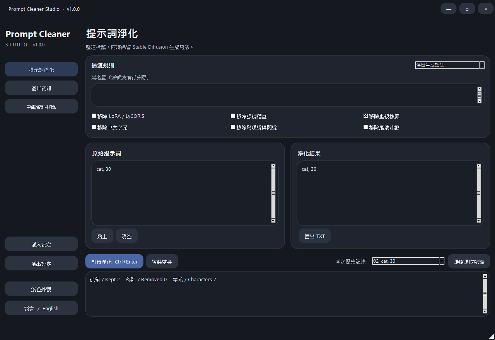
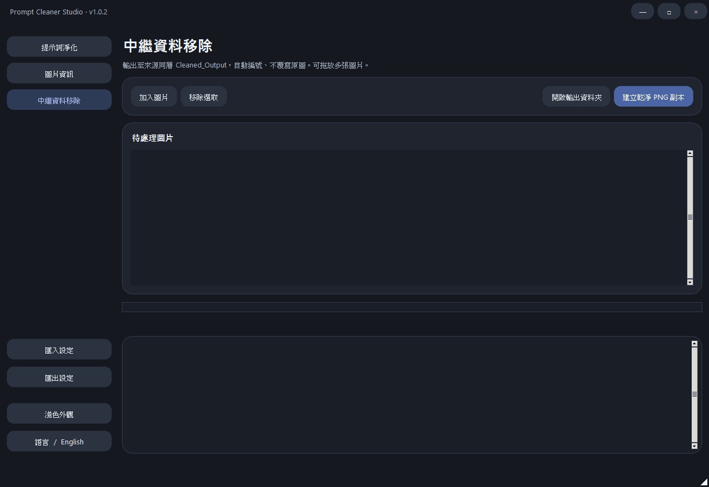

# Prompt Cleaner Studio

Windows 桌面工具，為 Stable Diffusion 使用者整理提示詞、檢視圖片生成資訊，以及批次移除圖片中繼資料。支援繁體中文／English 與深色／淺色介面。

## 下載

[下載 Prompt Cleaner Studio v1.0.3（Windows x64）](https://github.com/kekinai30108/PromptCleanerStudio/releases/download/v1.0.3/PromptCleanerStudio-v1.0.3-windows-x64.zip)

下載 ZIP 後解壓縮，直接執行 `PromptCleanerStudio.exe` 即可，不需要安裝 Python。適用於 Windows x64。

## 功能

- **提示詞淨化**：可依黑名單移除標籤，並處理重複標籤、LoRA／LyCORIS、強調權重、中文字元與尾端計數。
- **圖片資訊**：支援 PNG、JPEG、WebP，讀取可辨識的 A1111／ComfyUI 提示詞、模型、LoRA 與生成參數。
- **圖片拖放**：可拖入本機圖片或網頁圖片網址；預覽圖可直接點擊，隨時改選另一張圖片。
- **批次清理**：建立移除 EXIF、生成參數與 PNG 文字資訊的 PNG 副本，保留原始圖片。
- **介面切換**：按一下按鈕即可切換繁英語言與深淺外觀。

## 使用方式

### 淨化提示詞

1. 在「提示詞淨化」貼上提示詞。
2. 視需要輸入黑名單，或勾選要套用的規則。
3. 按「執行淨化」，再按「複製結果」或匯出 TXT。

### 檢視圖片生成資訊

1. 切換到「圖片資訊」。
2. 按「選擇圖片」、點擊預覽區，或把圖片拖進視窗。
3. 在右側查看正向／負向提示詞、LoRA 與生成參數。

PNG 通常保留較完整的資料；JPEG 與 WebP 能否解析，取決於產圖工具是否將生成資訊寫入圖片。

### 批次移除中繼資料

1. 切換到「中繼資料移除」。
2. 加入圖片或直接拖放多張圖片。
3. 按「建立乾淨 PNG 副本」。

輸出檔會放在每張來源圖片所在資料夾的 `Cleaned_Output` 內，不會覆寫原始圖片。

## 注意事項

- 網頁來源若提供縮圖、移除生成資訊、要求登入，或使用 `blob:`／`data:` 網址，可能無法解析。
- 批次清理只處理靜態 PNG、JPEG 與 WebP；不會移除圖片像素中的文字或浮水印。
- EXE 尚未進行程式碼簽章。

[查看所有發布版本](https://github.com/kekinai30108/PromptCleanerStudio/releases)
